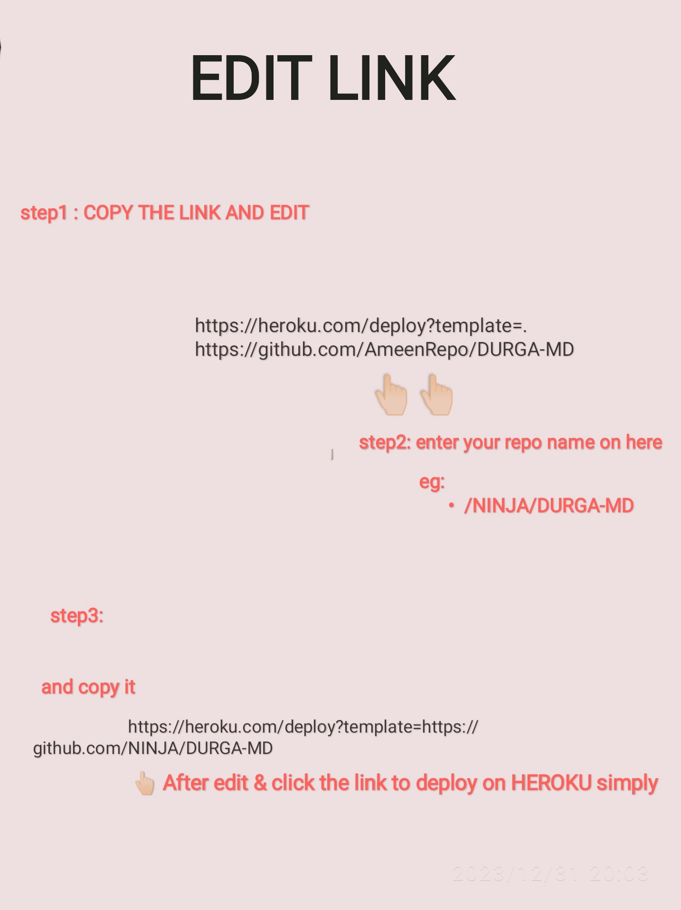

<p align="center">

# DURGA-MD

</p>
</br>

<a href="https://git.io/typing-svg"></a>
  
<p align="center">  
  <a href="https://wa.me/+916238768108?text=HEY+VRO+BIG+FAN+VRO😝">
    
   
</a> 

</p>

</br>

<p align="center">  
 
# SUPPORT

<a href='https://chat.whatsapp.com/GVxT4w51GIU3sndNPZGTnw' target="_blank"></a>
</p>

<br>

<p align="center">

# SCAN QR

<a href='https://replit.com/@raoneenemyinbox/QR-CODE-NOVA?v=1' target="_blank"></a>
</p>

<br>  

<p align="center">  

# FORK

<a href='https://github.com/AmeenRepo/DURGA-MD/fork' target="_blank"></a>
</p>

  <br>
🖤🖤🖤🖤🖤🖤🖤🖤
  <h3>💛AFTER FORKED SCAN QR AND GET A FILE ON YOUR WHATSAPP NAMED (DURGA.DATA.JSON) UPLOAD THIS FILE ON YOUR REPOSITORY🧡</h3>
🖤🖤🖤🖤🖤🖤🖤🖤
<br>
  
  <p align="center">  
  
# DEPLOY

<a href='https://render.com/register' target="_blank"></a>
</p>

<br>

<p align="center">  
<a href='https://dashboard.heroku.com' target="_blank"></a>


### COPY AND EDIT        
```
https://heroku.com/deploy?template=https://github.com/reponame/DURGA-MD
```
</p>
<p align="center">  
  <a href="https://wa.me/+916238768108?text=HEY+VRO+BIG+FAN+VRO😝">
    
   
</a> 

</p>

</br>

<p align="center">

## TERMUX DEPLOYMENT 
```bash
termux-setup-storage
pkg update && pkg upgrade
pkg install nodejs git ffmpeg libwebp 
git clone https://github.com/AmeenRepo/DURGA-MD
cd DURGA-MD
npm install
node main
```
</p>

#### For Help To Visit Here

<a href='https://instagram.com/mr.z_ninja' target="_blank"></a>
<br>

<a href='https://wa.me/916238768108?text=HEY🌠!Want-Help' target="_blank"></a>
<br>

<a href='https://github.com/AmeenRepo' target="_blank"></a>
<br>
